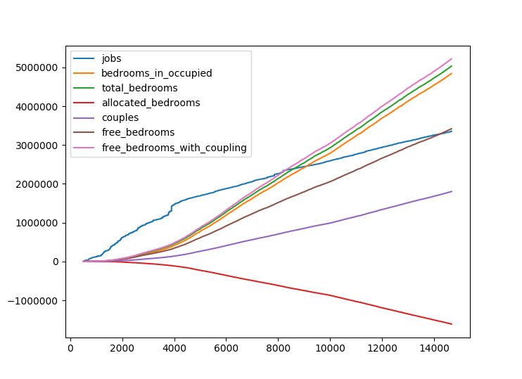

This is an attempt to answer the question "How big should the commuter zone for London really be?"

Imagine an increasing circle centred on Nelson's column. As that circle increases, there are more workers who work within it, but also more bedrooms. At what point does the number of bedrooms exceed the number of workers?

The answer seems to be between about 14km or 8.3km (if you try to account for couples sharing rooms). Either way, a lot smaller than London's actual commuter zone. Note however that this is a very rough attempt to answer the question!

# Intermediate Calculations
I've used 2011 census data to answer this question. Some intermediate measures were calculated
## Bedrooms ##
This is obtained by multiplying the number of 1 bedroom households by 1, 2 bedroom households by 2, etc. Unfortuantly the final category is '5 and above', so I multplied this number by 5. The number of bedrooms will therefore be less than reality.
## Bedrooms in Unoccupied Houses ##
The census only provides bedrooms in occupied households. I assume unoccupied households in the same area have the same mean number of bedrooms.
## Total Bedrooms ##
`Bedrooms` (in occupied households) + `Bedrooms In Unoccupied Houses`
## Allocated Bedrooms ##
Bedrooms occupied by the retired, people looking after their home or family, the disabled and sick. These are considered to be unavailable for workers to live in.
## Free Bedrooms ##
`Total Bedrooms` - `Allocated Bedrooms`
## Free Bedrooms With Coupling ##
Frees up bedrooms based on the principle that couples must share a bedroom. This it flawed, because this uses the number of couples currently living in each area - not the number of couples that would live in the area in this thought experiment.

# Plot #

# Running #

Census data is included in the `src/main/resources` directory. You also need boundaries for the 2011 Census Output Areas in a file `england_oa_2011_gen.kml`, which I downloaded from here:
https://borders.ukdataservice.ac.uk/easy_download_data.html?data=England_oa_2011
This is omitted from the repository due to its size.

The Java takes three command line arguments
1. Start latitude (51.5077553 for Nelson's column)
2. Start longitude (-0.1301189 for Nelson's column)
3. The name of a file for output

The Python 'plot.py' script takes two arguments and plots the output
1. The output file
2. The number of rows to plot
e.g `python3 plot.py out.csv 10000`

The script will plot whatever columns it finds against the `distance` column.